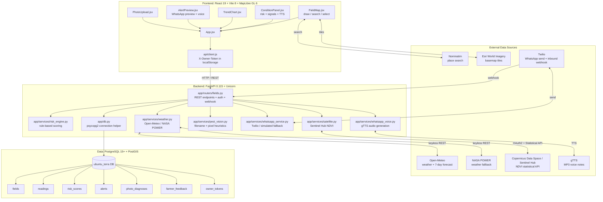

# Ubuntu Terra — Codebase Analysis

## Executive Summary

Ubuntu Terra is a demo-ready geospatial crop/water-stress monitoring application for South African farmers. The repository contains a React 19 + Vite 8 frontend (MapLibre GL map), a Python FastAPI 0.115 backend, and a PostgreSQL + PostGIS database with five numbered SQL migrations. Phases 1–4 of the hackathon feature set are implemented: field onboarding with click-to-draw polygons, NDVI/weather data fusion, an explainable rule-based risk engine, photo diagnosis heuristics, farmer feedback, and a Twilio WhatsApp voice/text alert pipeline with webhook replies. The code builds and installs cleanly on Python 3.10–3.13 with pinned dependencies, but a live PostgreSQL instance is required for the backend and most integration tests. The most urgent blockers before judging are: 10 stale risk-engine tests fail against the current function signature, there is no single ordered migration runner, no Docker/CI/CD exists, and the WhatsApp demo cannot run end-to-end without a real Twilio Auth Token. Security is deliberately demo-grade: a per-owner opaque token in `localStorage` replaces real authentication, CORS is restricted to an explicit allow-list, and Twilio webhook signatures are verified.

---

## Architecture Diagram

---

## Module-by-Module Breakdown

| Module | Purpose | Stack | Entry / Build | State |
|--------|---------|-------|---------------|-------|
| **frontend** | Interactive map, field list, condition panel, trend charts, alert preview, photo upload | React 19.2.8, Vite 8.3.0, MapLibre GL 6.11.1, Oxlint 1.81.0 | `npm install && npm run dev` → `http://localhost:5173`; `npm run build` → `frontend/dist` | **Working when dependencies installed.** No `node_modules` in the checked-out repo; must run `npm install` first. Production build has been verified by the team. |
| **backend** | FastAPI REST API, data services, risk engine, WhatsApp integration | Python 3.10–3.13, FastAPI 0.115.0, Uvicorn 0.30.6, psycopg2-binary 2.9.9, httpx 0.27.2, pydantic 2.9.2, twilio 9.8.0, gTTS 2.5.4 | `python -m uvicorn app.main:app --reload --port 8000` from `backend/` | **Working when DB is running and dependencies installed.** Imports cleanly. Unit tests for weather/satellite/health pass. |
| **database/migrations** | Schema evolution for fields, readings, risk_scores, alerts, photo_diagnoses, farmer_feedback, owner_tokens | PostgreSQL 15+, PostGIS extension, plain SQL | Apply manually via `for f in database/migrations/0*.sql; do psql "$DATABASE_URL" -f "$f"; done` | **Partial.** Migrations 001–005 are idempotent and correct, but there is **no single ordered runner**; `apply_migration.py` and `apply_migration_005.py` are ad-hoc one-file scripts. |
| **database/seed_demo_fields.py** | Inserts 3 demo fields in the Eastern Cape and a synthetic NDVI trigger for Patensie | Python + psycopg2 | `python seed_demo_fields.py` | **Working.** Idempotent (deletes by name before insert). Depends on 001 schema + 004 `is_demo_field` column. |
| **database/demo_ndvi_fixture.py** | Standalone helper to seed/refresh the Patensie demo NDVI trigger | Python + psycopg2 | Imported by `seed_demo_fields.py`; can also run directly | **Working.** |

---

## Database Schema Summary

| Table | Purpose | Key Columns | Geometry / Constraints | Indexes |
|-------|---------|-------------|------------------------|---------|
| `fields` | Field boundaries and ownership | `id SERIAL PK`, `name VARCHAR(255) NOT NULL`, `owner_id VARCHAR(255)`, `boundary GEOMETRY(POLYGON, 4326) NOT NULL`, `is_demo_field BOOLEAN NOT NULL DEFAULT FALSE`, `created_at TIMESTAMPTZ` | PostGIS polygon in WGS84; no FK on `owner_id` | `idx_fields_boundary` GIST on `boundary` |
| `readings` | Cached daily satellite/weather readings | `id SERIAL PK`, `field_id INTEGER NOT NULL FK → fields(id) ON DELETE CASCADE`, `date DATE NOT NULL`, `ndvi_value NUMERIC(4,3)`, `rainfall_mm NUMERIC(6,2)`, `temp_c NUMERIC(5,2)`, `source VARCHAR(100) NOT NULL`, `created_at TIMESTAMPTZ` | UNIQUE `(field_id, date, source)` | `idx_readings_field_date` on `(field_id, date)` |
| `risk_scores` | Daily risk-engine output | `id SERIAL PK`, `field_id INTEGER NOT NULL FK → fields(id) ON DELETE CASCADE`, `date DATE NOT NULL`, `score VARCHAR(10) CHECK ('Low','Medium','High')`, `reason_summary TEXT NOT NULL`, `created_at TIMESTAMPTZ` | UNIQUE `(field_id, date)` | `idx_risk_scores_field_date` on `(field_id, date)` |
| `alerts` | Alert messages + delivery record | `id SERIAL PK`, `field_id INTEGER NOT NULL FK → fields(id) ON DELETE CASCADE`, `risk_score_id INTEGER FK → risk_scores(id) ON DELETE SET NULL`, `message TEXT NOT NULL`, `channel VARCHAR(50) DEFAULT 'sms'`, `sent_at TIMESTAMPTZ` | | `idx_alerts_field` on `(field_id)` |
| `photo_diagnoses` | Vision classification results | `id SERIAL PK`, `field_id INTEGER NOT NULL FK → fields(id) ON DELETE CASCADE`, `filename VARCHAR(255)`, `category VARCHAR(100)`, `confidence NUMERIC(4,3)`, `description TEXT`, `model_name VARCHAR(100)`, `created_at TIMESTAMPTZ` | | `idx_photo_diagnoses_field` on `(field_id)` |
| `farmer_feedback` | Thumbs up/down accuracy feedback | `id SERIAL PK`, `field_id INTEGER NOT NULL FK → fields(id) ON DELETE CASCADE`, `risk_score_id INTEGER FK → risk_scores(id) ON DELETE CASCADE`, `photo_diagnosis_id INTEGER FK → photo_diagnoses(id) ON DELETE CASCADE`, `was_accurate BOOLEAN NOT NULL`, `farmer_comment TEXT`, `created_at TIMESTAMPTZ` | | `idx_farmer_feedback_field` on `(field_id)` |
| `owner_tokens` | Demo-grade per-owner opaque tokens | `token TEXT PK`, `owner_id TEXT NOT NULL UNIQUE`, `created_at TIMESTAMPTZ` | | PK on `token` |

**Notable schema observations:**
- All tables use `IF NOT EXISTS` and are idempotent.
- All foreign keys have `ON DELETE CASCADE` or `SET NULL`, so deleting a field cleans up dependent data.
- `fields.owner_id` is **not** a foreign key to `owner_tokens.owner_id`; ownership enforcement is done in application code via the `X-Owner-Token` header.
- No table tracks whether an alert was actually delivered vs. simulated; `whatsapp_service.py` returns a status string but the `alerts` table only stores `channel = 'whatsapp'`.
- No audit/trigger tracks when readings were last refreshed.

---

## Data Flow for the Core Use Case

> Farmer draws a field → satellite + weather data is pulled → stored → risk is computed → map + panel render → explanation + recommendation shown.

1. **Onboarding** (`frontend/src/components/FieldMap.jsx`, `backend/app/routers/fields.py:create_field`)
   - Farmer clicks vertices on the MapLibre satellite map; frontend closes the ring and POSTs `{name, boundary_geojson}` to `POST /api/fields`.
   - Backend validates GeoJSON Polygon structure, South Africa bounding box (16°E–33°E, 22°S–35°S), PostGIS validity, and area bounds (0.01–50,000 ha).
   - Ownership is taken from the `X-Owner-Token` header; any `owner_id` in the body is ignored.
   - **State: fully implemented.**

2. **Data ingestion** (`backend/app/services/weather.py`, `satellite.py`)
   - On field creation and on every `/readings`, `/risk`, `/alerts` call, `_sync_readings()` fetches recent weather (Open-Meteo, fallback NASA POWER) and NDVI (Sentinel Hub Statistical API).
   - Results are upserted into `readings` keyed by `(field_id, date, source)`.
   - If Sentinel Hub credentials are missing or the call fails **and** the field is a demo field, a synthetic declining NDVI series is seeded from `_seed_demo_ndvi_trigger()` and marked `source = 'demo_trigger'`.
   - **State: fully implemented, with graceful degradation.**

3. **Risk computation** (`backend/app/services/risk_engine.py`)
   - `_compute_and_cache_risk()` merges readings by date, fetches a 7-day rainfall forecast, and calls `assess_field_risk(ndvi, temp, forecast_rainfall_mm)`.
   - Rules flag Medium/High when NDVI is declining ≥ 8% **and** at least one of (forecast rainfall < 10 mm, temperature anomaly ≥ 2 °C) is true. High requires ≥ 15% NDVI decline + both contributing factors.
   - Result is cached in `risk_scores` with `(field_id, date)` uniqueness.
   - **State: fully implemented.** Tests in `test_risk_engine.py` are stale and fail because they still pass `rainfall_readings_mm=` to the old signature.

4. **Rendering** (`frontend/src/App.jsx`, `useFieldDashboard.js`, `ConditionPanel.jsx`, `TrendChart.jsx`, `FieldMap.jsx`)
   - `useFieldDashboard` loads field detail, readings, risk, and alerts independently via `Promise.allSettled` so partial failures do not blank the whole panel.
   - `ConditionPanel` displays the risk badge, water/heat/plant signal states, reasons, recommended check, voice read-aloud, feedback buttons, and any photo diagnosis.
   - `TrendChart` renders sparklines for NDVI, rainfall, and temperature.
   - `FieldMap` renders field polygons and custom SVG teardrop pins colored by risk.
   - **State: fully implemented.**

5. **Alerts & WhatsApp** (`backend/app/routers/fields.py:get_alerts`, `whatsapp_service.py`, `whatsapp_voice.py`)
   - `GET /api/fields/{id}/alerts` computes risk, generates a text message, calls gTTS to create an MP3, and invokes `send_whatsapp_alert_and_voice()`.
   - With `TWILIO_ACCOUNT_SID` + `TWILIO_AUTH_TOKEN` set, Twilio delivers the text + media message; otherwise it records a `simulated` status.
   - The alert row is inserted into `alerts` and returned with the audio URL.
   - Inbound replies hit `POST /api/whatsapp/webhook` (and `/whatsapp/webhook` alias). Twilio signature is verified; `YES/JA/YEBO` returns a confirmation, `MORE INFO` returns the latest risk explanation.
   - **State: implemented, but end-to-end live WhatsApp is blocked without a real `TWILIO_AUTH_TOKEN`.**

6. **Photo diagnosis** (`backend/app/services/pest_vision.py`, `frontend/src/components/PhotoUpload.jsx`)
   - Farmer uploads a photo; backend stores it under `backend/uploads/` and runs `analyze_crop_photo()`.
   - Classification uses filename keyword heuristics first, then a simple Pillow-based green vs. yellow-brown pixel ratio fallback.
   - The diagnosis is stored in `photo_diagnoses` and surfaced separately from the water-stress score in `ConditionPanel`.
   - **State: implemented as a heuristic/demo classifier, not a trained ML model.**

7. **Feedback & transparency** (`backend/app/routers/fields.py:submit_feedback`, `get_validation_stats`, `frontend/src/components/DisclaimerModal.jsx`)
   - `POST /api/feedback` saves a thumbs up/down response linked to a field, optionally to a risk score or photo diagnosis.
   - `GET /api/validation-stats` reports an agreement rate only after 20 responses; otherwise it returns `"not enough data yet"`.
   - A disclaimer modal and spoken disclaimer are shown on first view.
   - **State: fully implemented.**

---

## API Contracts

The backend exposes interactive OpenAPI/Swagger docs at `http://localhost:8000/docs` once running.

| Endpoint | Method | Auth | Purpose |
|----------|--------|------|---------|
| `/api/health` | GET | none | Liveness |
| `/api/owners/register` | POST | none | Mint a per-owner token |
| `/api/fields` | GET | `X-Owner-Token` | List own fields + demo fields |
| `/api/fields` | POST | `X-Owner-Token` | Create a field |
| `/api/fields/{id}` | GET | `X-Owner-Token` | Field detail |
| `/api/fields/{id}/readings` | GET | `X-Owner-Token` | Merged NDVI/weather readings |
| `/api/fields/{id}/risk` | GET | `X-Owner-Token` | Risk score + reasons + photo diagnosis |
| `/api/fields/{id}/alerts` | GET | `X-Owner-Token` | Alert history + generate new alert |
| `/api/fields/{id}/photos` | POST | `X-Owner-Token` | Upload + diagnose photo |
| `/api/fields/{id}/photos` | GET | `X-Owner-Token` | List stored photos |
| `/api/fields/{id}/photos/diagnoses` | GET | `X-Owner-Token` | List diagnoses |
| `/api/fields/feedback` / `/api/feedback` | POST | `X-Owner-Token` | Submit accuracy feedback |
| `/api/validation-stats` / `/validation-stats` | GET | none | Aggregate feedback stats |
| `/api/whatsapp/webhook` / `/whatsapp/webhook` | POST | Twilio signature | Inbound WhatsApp reply handler |

**Authentication model:** per-owner opaque random token. No passwords, sessions, expiry, rotation, or rate limiting. The token is stored in `localStorage` on the frontend.

**CORS:** explicit allow-list from `ALLOWED_ORIGINS` env var; no wildcard.

---

## Quality & Risk Signals

### Test Coverage

| Suite | Location | Type | Needs DB | State |
|-------|----------|------|----------|-------|
| `test_health.py` | `backend/tests/` | Unit | No | ✅ Passes |
| `test_risk_engine.py` | `backend/tests/` | Unit | No | ❌ 10/10 fail — stale signature |
| `test_weather.py` | `backend/tests/` | Unit (MockTransport) | No | ✅ Passes |
| `test_satellite.py` | `backend/tests/` | Unit (MockTransport) | No | ✅ Passes |
| `test_whatsapp_webhook.py` | `backend/tests/` | Unit/integration | Yes (app startup) | ⚠️ Fails without running DB; intended to pass with DB |
| `test_fields_router.py` | `backend/tests/` | Integration | Yes | ⚠️ Needs seeded DB; not run in this review |
| `test_database.py` | `backend/tests/` | Integration | Yes | ⚠️ Needs seeded DB; not run in this review |
| Frontend tests | — | — | — | ❌ None exist |

### Error Handling, Logging, Observability

- **Error handling:** service-level exceptions are swallowed in `_sync_readings()` so endpoints fall back to cached data. HTTPExceptions are raised for validation/auth failures. There is no centralized error logging beyond `logger.warning` in `whatsapp_service.py`.
- **Logging:** minimal. No structured logging, request IDs, or correlation IDs.
- **Observability:** none. No metrics, health checks beyond `/api/health`, tracing, or alerting.
- **Frontend resilience:** `useFieldDashboard` uses `Promise.allSettled` to render partial data.

### Security Posture

| Area | State | Notes |
|------|-------|-------|
| Secrets in repo | ✅ Clean | `.env` and `backend/uploads/` are gitignored. `.env.example` contains placeholders only. |
| CORS | ✅ Restricted | Explicit origin allow-list, no wildcard. |
| SQL injection | ✅ Low risk | All SQL uses parameterized `%s` placeholders; no string-built queries. |
| Input validation | ✅ Present | GeoJSON shape, SA bounding box, PostGIS validity, area bounds. |
| Auth/AuthZ | ⚠️ Demo-grade | Per-owner opaque token; no expiry/rotation/rate limiting; token in `localStorage`. |
| Twilio webhooks | ✅ Verified | `X-Twilio-Signature` checked; fails closed (500) when token unset. |
| Photo storage | ⚠️ Local disk | `backend/uploads/` with no admin review queue or virus scanning. |
| HTTPS enforcement | ❌ Not enforced | No `HTTPSRedirect` middleware or HSTS headers. |
| Dependency CVEs | ⚠️ Unknown | Pins are fixed but not audited; see dependency list. |

### Performance / Scale Concerns

- **No spatial index on readings.** `idx_readings_field_date` is a B-tree; geospatial queries against `fields.boundary` use `idx_fields_boundary` GIST, which is good.
- **Per-request external API calls.** Every `/readings`, `/risk`, `/alerts` call re-fetches weather and attempts NDVI, so load spikes hit external services. No in-memory or Redis cache beyond the DB `readings` table.
- **Unbounded readings growth.** No retention/rollup policy; readings accumulate indefinitely per field per source per day.
- **Map data payload size.** Field list returns full GeoJSON polygons; with many fields this could become large. No pagination on `/api/fields`.
- **Image uploads unbounded.** No file-size limits or storage quotas in `upload_field_photo`.

---

## Key Risks and Unknowns Requiring a Human Decision

1. **Test suite is red (10 failures).** Is the priority to update `test_risk_engine.py` to the new `forecast_rainfall_mm` signature, or to keep the old signature and change the engine? (Current engine matches planning.md intent; tests are stale.)
2. **No single migration runner.** Should we create `database/migrate.py` and delete the ad-hoc `apply_migration*.py` scripts?
3. **Demo vs. real WhatsApp.** The live Twilio demo requires a real Auth Token and a public HTTPS webhook URL. Will the judging demo use the simulated fallback only, or do we need a live sandbox setup?
4. **Python 3.10 vs. 3.11–3.13.** README says avoid 3.14 but recommends 3.11–3.13. The current environment has Python 3.10.6 and dependencies install fine. Should the project officially support 3.10+ or stick to 3.11+?
5. **No Docker / CI / deployment.** This is the single biggest reproducibility risk for judges. Do we add `docker-compose.yml` + GitHub Actions before submission?
6. **Owner-token auth is not real authentication.** This is acknowledged as demo-grade. Do we accept this for the hackathon, or add password/login + httpOnly cookies?
7. **Photo classifier is heuristic only.** It uses filename keywords and pixel colors, not a trained model. Do we label this clearly as a demo/mock in the slide deck?
8. **Validation-stats threshold of 20** is unreachable in a short demo. Should the UI show a provisional/early-stage badge instead?
